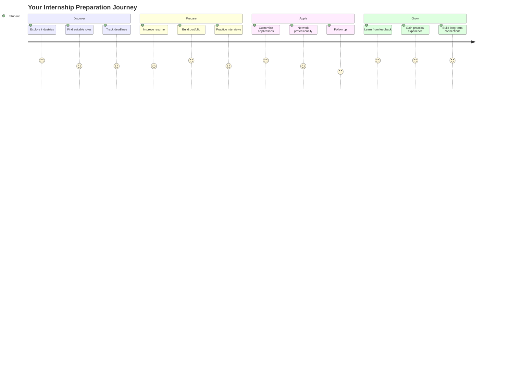

<div align="center">

# 🎓 INTERNSHIPS BSC 2026

### Discover. Prepare. Apply. Build your future.


<br>


<br><br>

[](https://github.com/asifverse4/INTERNSHIPS_BSC_2026)
[](https://github.com/asifverse4/INTERNSHIPS_BSC_2026)
[](https://github.com/asifverse4/INTERNSHIPS_BSC_2026)

</div>

---

## 🌐 About This Repository

`INTERNSHIPS_BSC_2026` is a curated space for students searching for internships, preparing applications, improving technical skills, and building a stronger professional profile.

This repository is designed to help you move through the complete internship journey:

```text
Discover → Prepare → Build → Apply → Interview → Grow
```

> An internship is not only an opportunity to work.
> It is an opportunity to prove what you can become.

---

## 🧭 Internship Journey



---

## ⚡ Quick Start

### 1. Understand your direction

Choose the area that matches your interests:

- Software Development
- Web Development
- Data Science
- Artificial Intelligence
- Machine Learning
- Cybersecurity
- Cloud Computing
- DevOps
- UI/UX Design
- Product Management
- Business Analysis
- Research

### 2. Prepare your profile

Your profile should include:

- A clear resume
- A professional LinkedIn profile
- A GitHub profile
- Practical projects
- Relevant technical skills
- A short professional introduction
- Your academic information
- Certificates or achievements

### 3. Start applying

Do not wait until everything is perfect.

```text
Learn something → Build something → Document it → Apply → Improve
```

---

## 🛰️ Application Command Center

| Area | What to Prepare |
|---|---|
| Resume | One-page, clear, achievement-focused resume |
| Portfolio | 2–4 projects with explanations and screenshots |
| GitHub | Organized repositories with useful README files |
| LinkedIn | Professional headline, summary, and updated skills |
| Skills | Technical and communication skills |
| Networking | Meaningful conversations with professionals |
| Interviews | Technical, behavioral, and project-based preparation |
| Tracking | Application status, deadlines, and follow-ups |

---

## 📄 Resume Formula

Use this structure when describing your projects:

```text
Action + Technology + Result
```

### Weak Description

```text
Created a website using Python.
```

### Strong Description

```text
Developed a Python and Flask task-management application
with user authentication and CRUD functionality, improving
task organization for test users.
```

### Resume Checklist

- [ ] Keep it concise
- [ ] Use action verbs
- [ ] Mention technologies
- [ ] Include measurable results when possible
- [ ] Remove unnecessary personal information
- [ ] Check grammar and spelling
- [ ] Export as PDF
- [ ] Use a professional file name

Example:

```text
YourName_Resume_2026.pdf
```

---

## 🧰 Portfolio Project Ideas

### Beginner Projects

- Personal portfolio website
- Expense tracker
- To-do application
- Weather dashboard
- Quiz application
- Calculator
- Password generator
- Study planner

### Intermediate Projects

- Job application tracker
- REST API
- E-commerce prototype
- Real-time chat application
- Blog platform
- Data visualization dashboard
- Web scraping project
- Authentication system

### Advanced Projects

- AI-powered career assistant
- Internship recommendation system
- Resume analyzer
- Full-stack SaaS application
- Machine learning prediction system
- Cloud-deployed application
- Open-source contribution
- Developer productivity platform

---

## 🧪 Project Documentation Template

Every portfolio project should explain:

```markdown
# Project Name

## Problem
What problem does this project solve?

## Solution
How does your application solve the problem?

## Features
- Feature one
- Feature two
- Feature three

## Technologies
- Technology one
- Technology two
- Technology three

## What I Learned
Explain the most important lessons from the project.

## Future Improvements
Describe what you would add next.
```

---

## 🔎 Where to Search for Internships

Search across multiple channels instead of relying on only one platform.

| Source | Strategy |
|---|---|
| Company career pages | Apply directly through official websites |
| University career portals | Check regularly for verified listings |
| LinkedIn | Follow companies and connect professionally |
| GitHub | Explore open-source projects and organizations |
| Job boards | Set alerts for relevant keywords |
| Professional communities | Participate before asking for opportunities |
| Career fairs | Prepare a short introduction |
| Networking | Ask thoughtful questions and request advice |

> Always verify internship listings through official company sources before sharing personal information.

---

## 📬 Professional Outreach Template

```text
Subject: Student Interested in [Role] Opportunities

Hello [Name],

I am a student interested in [specific field or role]. I recently
worked on [short project or achievement], where I used [technology].

I am currently exploring internship opportunities in this area and
would appreciate any advice about skills, projects, or application
processes that could help me improve.

Thank you for your time.

Best regards,
[Your Name]
[GitHub or Portfolio Link]
[LinkedIn Link]
```

---

## 🎤 Interview Preparation

### Technical Preparation

- [ ] Review programming fundamentals
- [ ] Practice data structures and algorithms
- [ ] Understand your own projects deeply
- [ ] Explain your technical decisions
- [ ] Practice debugging
- [ ] Review Git and GitHub
- [ ] Study the technologies listed in the job description

### Behavioral Preparation

Use the **STAR method**:

```text
S — Situation
T — Task
A — Action
R — Result
```

Prepare stories about:

- A difficult project
- A technical mistake
- Team collaboration
- A conflict or disagreement
- Learning a new technology
- Meeting a deadline
- Receiving feedback
- Solving an unfamiliar problem

---

## 📊 Application Tracker

You can create a simple tracker like this:

| Company | Role | Date Applied | Status | Follow-up Date |
|---|---|---:|---|---:|
| Example Company | Software Intern | 2026-01-15 | Applied | 2026-01-25 |
| Example Company | Data Intern | 2026-01-20 | Interview | — |
| Example Company | Web Intern | 2026-01-22 | Saved | 2026-01-30 |

Possible statuses:

```text
Saved → Preparing → Applied → Assessment → Interview → Offer → Closed
```

---

## 🧠 Weekly Preparation Plan

| Day | Focus |
|---|---|
| Monday | Search and save new opportunities |
| Tuesday | Improve one technical skill |
| Wednesday | Build or document a project |
| Thursday | Practice interview questions |
| Friday | Send applications |
| Saturday | Network and improve your profile |
| Sunday | Review progress and plan the next week |

---

## 🏆 Skills That Make You Stand Out

### Technical Skills

- Programming fundamentals
- Version control with Git
- API usage
- Databases
- Testing
- Debugging
- Basic system design
- Cloud fundamentals
- Data structures and algorithms

### Professional Skills

- Clear communication
- Team collaboration
- Time management
- Problem-solving
- Curiosity
- Adaptability
- Writing documentation
- Receiving feedback

---

## 🔐 Safety While Applying

Be careful when applying online:

- Verify the company website.
- Never pay to apply for an internship.
- Do not share passwords or private keys.
- Avoid suspicious download links.
- Confirm recruiter email domains.
- Never share unnecessary financial information.
- Research the company before attending an interview.
- Report suspicious listings to the platform.

---

## ✅ Final Application Checklist

Before submitting an application:

- [ ] Resume is updated
- [ ] Resume is customized for the role
- [ ] Portfolio link works
- [ ] GitHub repositories are organized
- [ ] Project README files are complete
- [ ] Spelling and grammar are checked
- [ ] Company details are verified
- [ ] Application deadline is confirmed
- [ ] Cover letter is customized
- [ ] Contact information is correct

---

## 🚀 The Career Equation

```python
def career_progress(learning, practice, projects, consistency):
    return learning + practice + projects + consistency
```

```text
Progress = Learning + Practice + Projects + Consistency
```

You do not need to know everything before applying.

You need to show that you are:

- Willing to learn
- Capable of building
- Comfortable with challenges
- Ready to accept feedback
- Consistent in your effort

---

## 🤝 Contributing

Useful contributions are welcome.

You can contribute by adding:

- Verified internship sources
- Preparation guides
- Resume tips
- Interview questions
- Project ideas
- Scholarship opportunities
- Career roadmaps
- Student-friendly resources

### Contribution Steps

```bash
git clone https://github.com/asifverse4/INTERNSHIPS_BSC_2026.git
cd INTERNSHIPS_BSC_2026
git checkout -b add-new-resource
```

Then:

1. Add or improve useful content.
2. Check links and formatting.
3. Keep information clear and relevant.
4. Submit a pull request.

---

<div align="center">

## 🌟 Build Skills. Find Opportunities. Start Your Journey.


<br>

### Your next opportunity may begin with the next thing you learn.

</div>
